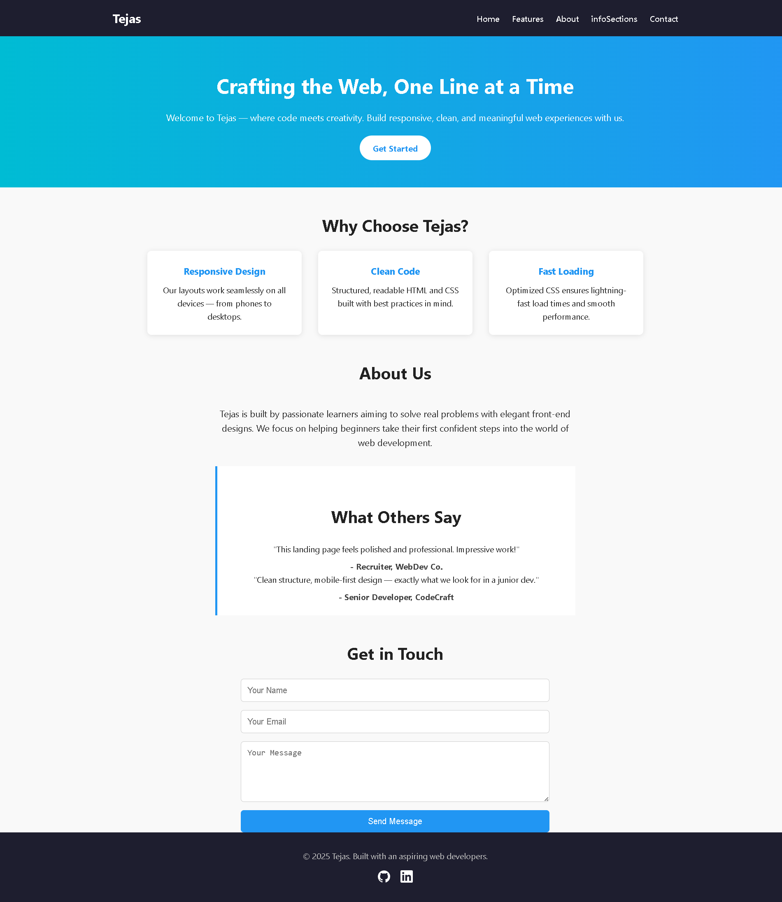

# 🌐 Tejas - Responsive Landing Page

Welcome to **Tejas**, a clean and modern responsive landing page designed using HTML5 and CSS3. This project was created as part of a Web Development Internship Task and focuses on building a visually appealing and mobile-friendly landing experience.


This is my the page [Visit](https://tejassomnathe.github.io/Elevates-Lab-Task-1)


## ✨ Features

- ✅ Fully Responsive Layout (Mobile, Tablet, Desktop)
- 🎨 Clean, Minimalist UI Design
- 📦 CSS Flexbox-based Layout System
- 💬 Structured Semantic HTML5
- ⚡ Fast and Lightweight
- 🌍 Social Links and Contact Form Included

## 📸 Screenshots

| Desktop View |
|--------------|
|  |

## 🧱 Folder Structure

project-root/
├── index.html
├── style.css
├── img/
│ ├── githubimg.svg
│ ├── linkedinimg.svg
│ ├── tejassomnathe.github.io_Elevates-Lab-Task-1_.png
│ └── tejassomnathe.github.io_Elevates-Lab-Task-1-_(1).png
└── README.md


## 📱 Responsive Design

Built mobile-first using media queries to ensure perfect display on all screen sizes.

## 🔧 Tools Used

- HTML5  
- CSS3  
- VS Code (with Live Server)  
- Google Fonts & Icons (via CDN)

## 🚀 Getting Started

To view the project locally:

```bash
git clone https://github.com/TejasSomnathe/tejas-landing-page.git
cd tejas-landing-page
```


🙋‍♂️ About Me
I'm Tejas, an aspiring web developer passionate about creating user-focused digital experiences. This landing page reflects my understanding of semantic HTML, responsive design, and clean UI.
